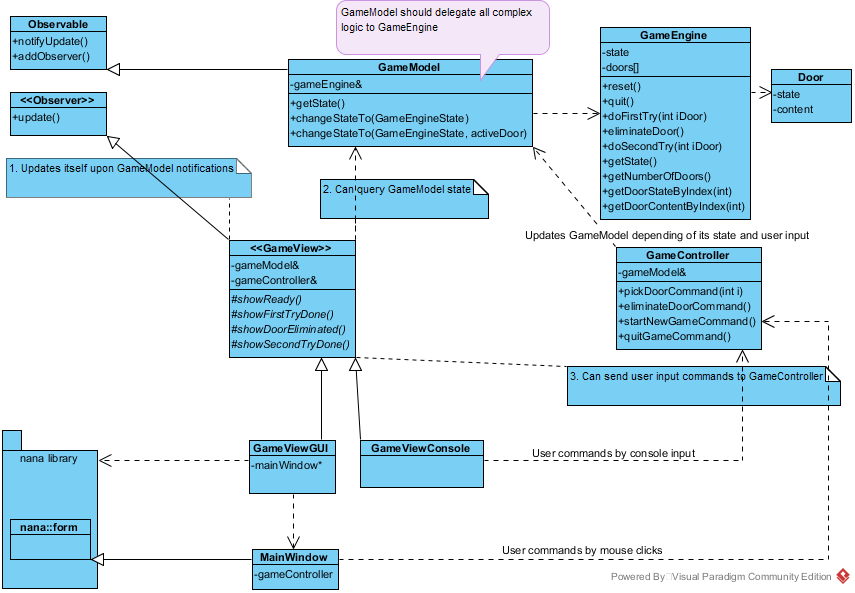

monty_hall_problem
==============================================

Program Description
----------------------------------------------

This is a simulation of [Monty Hall problem](https://en.wikipedia.org/wiki/Monty_Hall_problem) in C++ with nana library for GUI. The program demonstrates how to apply MVC architecture to application development.
Here is [my youtube video](https://www.youtube.com/watch?v=Y6S4p4Pz9R4) which shows the working program.

Class Diagram
----------------------------------------------

Building Tips
----------------------------------------------

Set Project Properties for Visual Studio 2017

1. C/C++ > General > Additional Include Directories

   `$(CPP_NANA_LIB_ROOT)\include\;`

2. C/C++ > Code Generation > Runtime Library

   `Multi-threaded Debug DLL (/MDd)`

3. Linker > General > Additional Library Directories

   `$(CPP_NANA_LIB_ROOT)\build\bin;$(CPP_NANA_LIB_ROOT)\extrlib\VC2017;`

4. Linker > Input > Additional Dependencies

    `nana_v141_Debug_x64.lib;libjpeg.MDd.x64.lib;libpng.MDd.x64.lib;libzlib.MDd.x64.lib;%(AdditionalDependencies)`

License
------------------------------------------------

This project is licensed under the [MIT License](https://opensource.org/licenses/MIT). Copyright 2018, zubrim[at]kashkan.info.